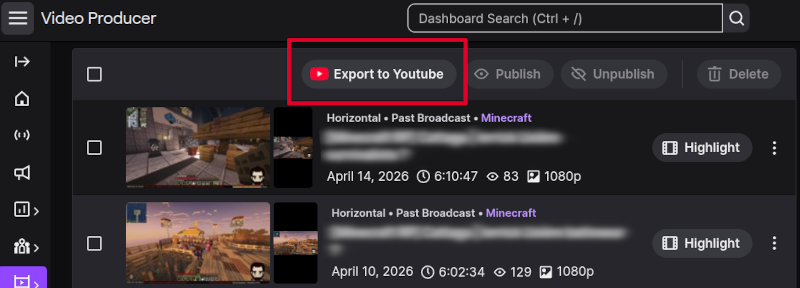
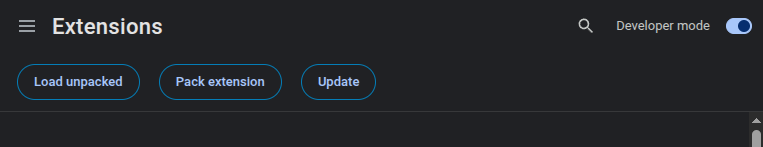
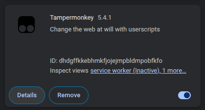
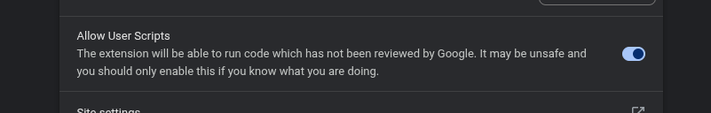
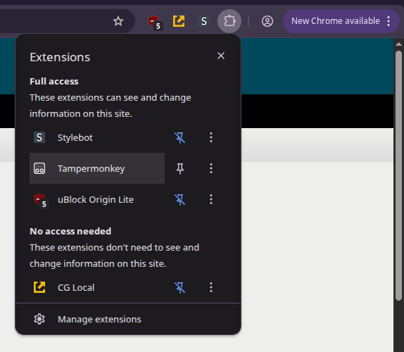
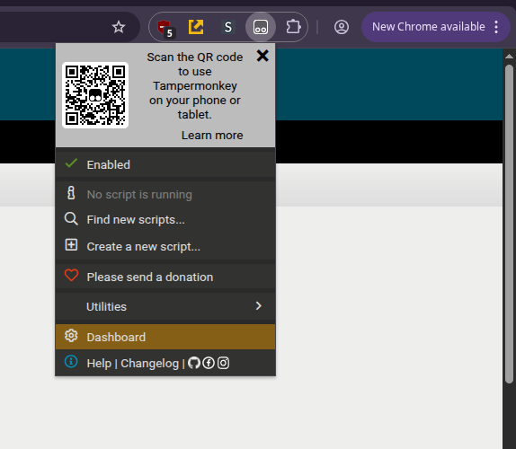
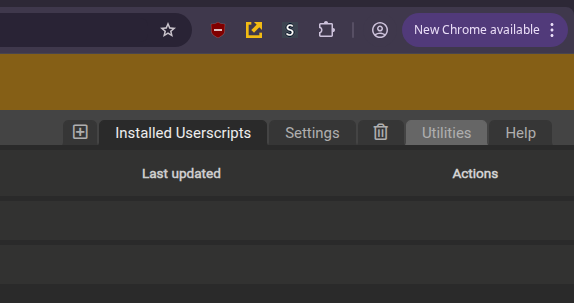
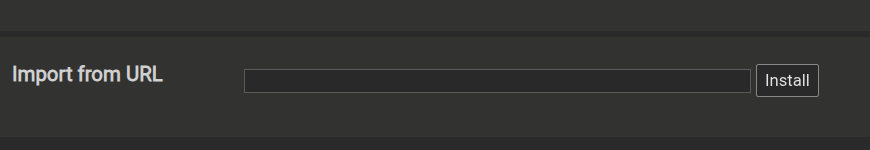
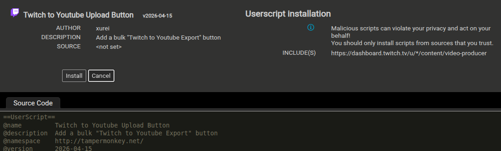

# 🎬 Twitch ➡️ YouTube Export Button

Ce script Tampermonkey ajoute un bouton **Export to YouTube** dans l'interface **Video Producer** de Twitch, permettant d'exporter plusieurs vidéos en une seule fois vers YouTube.



----------

## 🙄 "J'ai la flemme de lire de la doc"
Ca tombe bien ! J'ai fait une vidéo tuto :
[![\[TUTO\] Exportez vos vidéos Twitch vers Youtube facilement !](https://img.youtube.com/vi/la-OwaGcf2k/0.jpg)](https://www.youtube.com/watch?v=la-OwaGcf2k "[TUTO] Exportez vos vidéos Twitch vers Youtube facilement !")

## ⚠️ Disclaimer (important)

Cet outil se base sur **Tampermonkey** pour injecter le code requis.

Son utilisation comporte des risques :
- Un script peut potentiellement accéder aux données affichées sur les pages que vous visitez,
- Un script malveillant pourrait modifier des actions ou voler des informations
    

👉 **Avant d'installer un script (y compris celui-ci) :**
- Faites-le relire par une personne de confiance **ou**
- Demandez à une IA d'analyser le code (moins fiable, mais mieux que rien)

➡️ N'installez **jamais** un script dont vous ne comprenez pas l'origine ou dont vous n'avez pas confiance.

----------

## 🧩 1. Installer Tampermonkey (rapide)

Tampermonkey est une extension navigateur qui permet d'exécuter des scripts personnalisés.

### Étapes :
1. Aller sur le site officiel :  
   [https://www.tampermonkey.net/](https://www.tampermonkey.net/)
2. Cliquer sur **Download**
3. Installer l'extension pour votre navigateur
4. Une fois installé, une icône Tampermonkey apparaît dans votre navigateur
5. Sous Chrome, vous devez activer le mode développeur et cocher "Allow User scripts" dans les paramètres de l'extension.
   - Rendez-vous sur `chrome://extensions/` et cocher la case "Developer mode" :
     
   - Ensuite, cliquez sur "Details" de Tampermonkey et cochez "Allow User scripts"    
      
     

----------

## 📜 2. Installer le script

### Étapes :
1. Cliquez sur l'icône **Tampermonkey** dans votre navigateur,
   
2. Cliquez sur **Dashboard**, puis **Utilities**,    
   
   
3. Dans "Import from URL", collez ce lien :    
   `https://raw.githubusercontent.com/xurei/twitch-to-youtube-export-btn/refs/heads/main/userscript.js`
   et cliquez sur **Install**
   
4. Confirmez l'installation en cliquant sur **Install**  
   (⚠️ N'oubliez pas de faire relire le code)
   

✅ Le script est maintenant installé !

----------

## ▶️ 3. Utilisation

1. Ouvrez votre **Video Producer** sur Twitch
2. Cochez les vidéos que vous souhaitez exporter    
3. Cliquez sur le bouton **"Export to YouTube"** (ajouté par le script)    
4. Confirmez la popup    
5. Le script va :    
   - Ouvrir chaque vidéo        
   - Pré-remplir le titre        
   - Mettre la visibilité en *non répertorié (unlisted)*       
   - Lancer l'export automatiquement
        
----------

### 📌 Résultat

- Les vidéos seront envoyées vers votre chaîne YouTube avec comme titre :
  ```
  [DATE] - [TITRE TWITCH]
  ```    
- Un message récapitulatif apparaîtra lorsque l'export est terminé
- Il faut attendre quelques minutes avant que les vidéos apparaîssent dans votre Youtube Studio, c'est normal.
    
----------

## ⚙️ Notes importantes

- Vous devez avoir connecté votre compte YouTube dans Twitch. Vous pouvez le faire ici : https://www.twitch.tv/settings/connections    
- Les exports sont envoyé sur Youtube en **non listé**. Vous pouvez modifier leur état de publication sur [Youtube Studio](https://studio.youtube.com/channel/).    
- Durant le processus, ne cliquez pas ailleurs
       
----------

## 🧪 Dépannage

### Le bouton n'apparaît pas ?
- Rechargez la page    
- Vérifiez que Tampermonkey est actif    
- Vérifiez que le script est bien activé
    

### Rien ne se passe ?
- Vérifiez que vous avez bien coché des vidéos    
- Regardez la console navigateur (`F12`) pour voir les logs. Dans l'onglet "Console", vous devriez y voir (entre autres) :   
  ```
  [Twitch to Youtube Export Button] Loading...
  [Twitch to Youtube Export Button] Waiting for UI to load...
  [Twitch to Youtube Export Button] Ready !
  ```   
  Si cela n'apparaît pas, le script n'est pas chargé.

En cas de problème, vous pouvez créer une "Issue" ici : https://github.com/xurei/twitch-to-youtube-export-btn/issues

----------

## 🧹 Désinstallation

1. Ouvrez Tampermonkey    
2. Supprimez ou désactivez le script
    
----------

## 💬 Remarque finale

Ce script automatise une tâche répétitive mais reste dépendant du comportement de Twitch. Il est possible que Twitch modifie son interface, rendant le script non fonctionnel.

J'utilise ce script tous les mois donc *en principe* il sera toujours à jour. Si néanmoins il ne fonctionne plus, n'hésitez pas à me contacter.

----------
